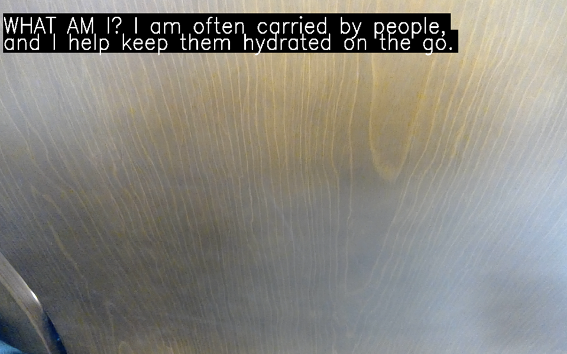
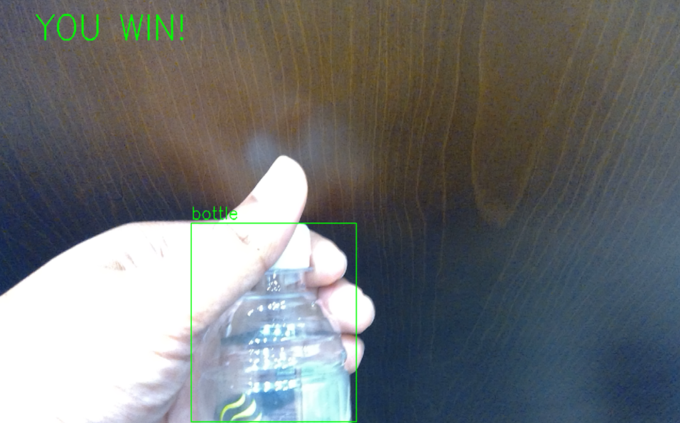
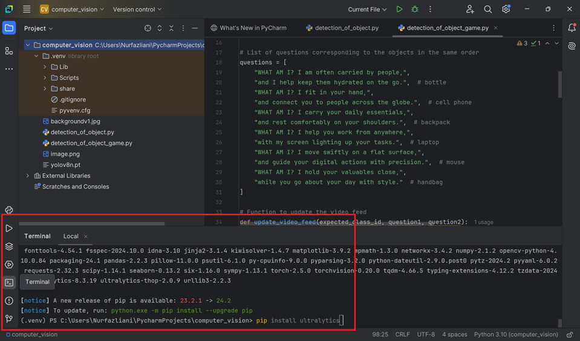

# SimpleComputerVisionGame

 | 

An **Interactive Introduction to Computer Vision** game designed for students with no prior knowledge of the topic. This project allows students to engage with computer vision concepts through a fun and interactive guessing game.

## The Purpose

This game is designed to introduce students to the basics of computer vision by allowing them to participate in a real-time object detection game. It's intended for beginners and provides a hands-on learning experience in a classroom setting.

## How It Works

- The game uses a **YOLO model** to detect objects through a live webcam feed.
- The game displays a series of questions or clues about everyday objects (e.g., "I am used to store water and keep people hydrated" for a bottle).
- Students raise their hands to participate and come to the front to show their object to the camera.
- If the detected object matches the clue, the student wins, and the next round begins.

## Key Features

- **Real-time Object Detection**: Powered by YOLO, the game detects objects live from the camera feed.
- **Interactive Learning**: Students are engaged through a guessing game that helps them understand how computer vision systems recognize objects.
- **Simple Interface**: The game uses OpenCV to display the webcam feed and the current question, making it easy to interact with.

## Objects Detected

The game uses a pre-trained YOLOv8 model to detect the following common objects:

1. **Bottle** - A container typically used to store liquids such as water, soda, or juice. Bottles come in various sizes and materials, commonly made of plastic or glass.
2. **Cell Phone** - A portable communication device used for making calls, sending messages, and accessing the internet. Smartphones are the most common type of cell phone, offering many additional features.
3. **Backpack** - A bag carried on the back, often used by students and travelers to carry books, supplies, and personal items.
4. **Laptop** - A portable personal computer designed to be used on your lap. It provides most of the functionalities of a desktop computer, with the added advantage of mobility.
5. **Mouse** - A handheld device used to control the pointer on a computer screen, typically with buttons for clicking and a scroll wheel for navigating.
6. **Handbag** - A small bag used by individuals, often women, to carry personal items such as wallets, phones, and makeup.

The game challenges students to present these objects to the camera in response to the questions asked during the gameplay. The first student to correctly show the object as detected by the computer vision model wins the round.

## Setup

Pre-requisite:
1. Install pycharm into your system. Follow this great instruction by kjdElectronics link:
   www.youtube.com/watch?v=0y5XlNeFxNk

Running the script: 
1. Download the script:
   **detection_of_object_game.py**
   
3. Move the script into your project directory it should look like this:
   **(C:\Users\<Username>\PycharmProjects\<your_project_name>\)**

4. In pycharm please install the required dependencies, use the terminal:
   
   
   
   **pip install ultralytics**

6. In pycharm's terminal you can run this command or click the run button:
   **python detection_of_object_game.py**
